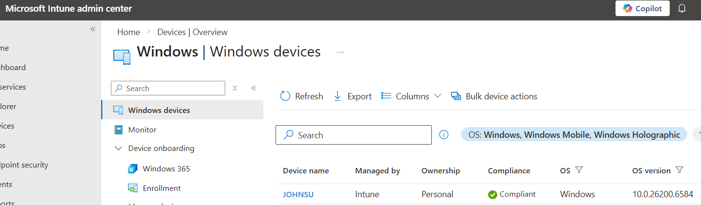
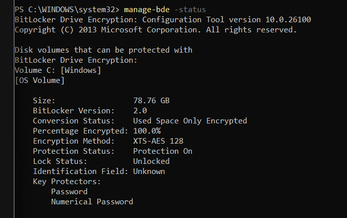
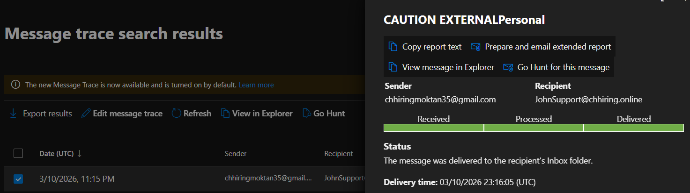
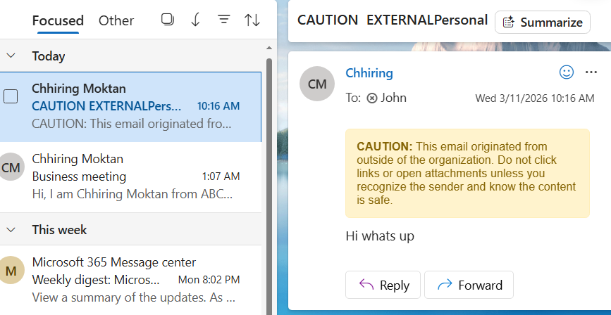

# Microsoft 365 Enterprise Administration Lab

## Overview
This project demonstrates hands-on implementation of Microsoft 365 enterprise services including identity management, device management, collaboration tools and security compliance.

The lab simulates a small enterprise environment using Microsoft 365 services.

## Technologies Used

- Microsoft Entra ID
- Microsoft Intune
- Microsoft 365 Admin Center
- Exchange Online
- SharePoint Online
- Microsoft Teams
- Microsoft Defender
- Microsoft Purview

## Project Phases

### Phase 1 – Identity & Access (Entra ID)
- User creation
- Security groups
- License assignment
- Multi-Factor Authentication
- Conditional Access

### Phase 2 – Microsoft 365 Admin Setup
- Tenant configuration
- Admin roles
- Service configuration

### Phase 3 – Endpoint Management (Intune)
- Windows device enrollment
- iPhone enrollment
- Win32 application deployment
- BitLocker policy
- Attack Surface Reduction rules

### Phase 4 – Collaboration Services
- SharePoint site creation
- OneDrive configuration
- Microsoft Teams collaboration

### Phase 5 – Security & Compliance
- Microsoft Defender policies
- Data Loss Prevention
- eDiscovery cases

## Skills Demonstrated

- Cloud Identity Management
- Endpoint Security
- Enterprise Collaboration
- Microsoft 365 Administration
- Security & Compliance

## 🛠 Phase 1: Identity & Access Management (Entra ID)
In this phase, I built the identity foundation. I configured a custom domain, managed user lifecycles, and verified cloud identity integration.

### What I Accomplished:
* **Domain Setup:** Added and verified a custom domain for a corporate identity.
* **User Management:** Created bulk users via CSV and manual admin accounts (John Support).
* **Licensing:** Assigned M365 Business Premium/E5 licenses to active users.
* **Device Join:** Successfully performed an **Entra ID Join** for a Windows 11 VM.

### Phase 1 Proof:
/11_Entra_ID_Join_Confirmation.png)
---
## 📱 Phase 2: Endpoint Management & Security (Intune)

In this phase, I moved beyond identity to manage and secure Windows 11 and iOS endpoints. I focused on security baselines, disk encryption, and automated software deployment.

### Key Achievements:
* **Endpoint Security:** Implemented **BitLocker** encryption and **Attack Surface Reduction (ASR)** policies.
* **Compliance & Access:** Configured **Conditional Access** policies to ensure only compliant devices can access corporate resources.
* **Win32 App Packaging:** Successfully packaged and deployed .exe/msi applications (7-Zip) using the **Intune Win32 Content Prep Tool**.
* **Mobile Management (MAM):** Deployed business applications (Teams) to mobile devices via the Company Portal.

### Phase 2 Evidence:

---
## 📧 Phase 3: Messaging & Collaboration (Exchange Online)

In this phase, I configured the enterprise email environment, focusing on mail flow security, resource management, and administrative auditing.

### Key Technical Achievements:
* **Mail Flow Management:** Created **Transport Rules** to apply "External Email" warning tags to prevent phishing.
* **Shared Resources:** Configured **Shared Mailboxes** and **Room/Resource Mailboxes** with proper delegation (Full Access/Send As).
* **Security & Compliance:** Implemented **Anti-Spam policies** and performed **Message Traces** to troubleshoot delivery issues.
* **Automation:** Developed **Dynamic Distribution Groups** to automate membership based on user attributes.
* **Modern Scheduling:** Deployed **Microsoft Bookings** for automated appointment scheduling.

### Phase 3 Evidence:

